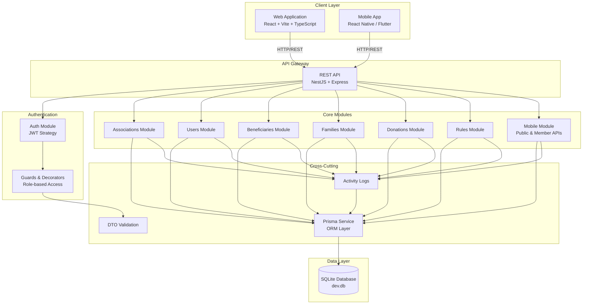
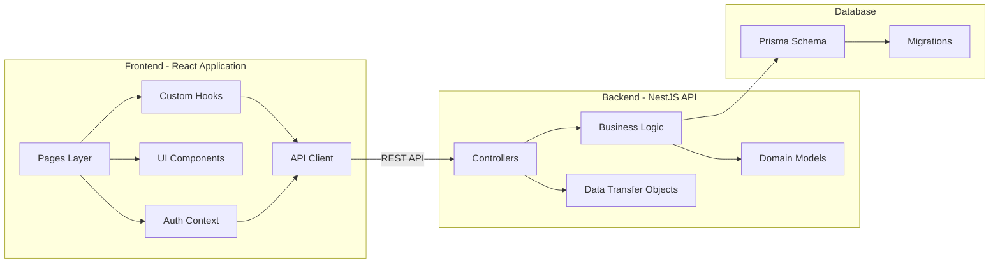
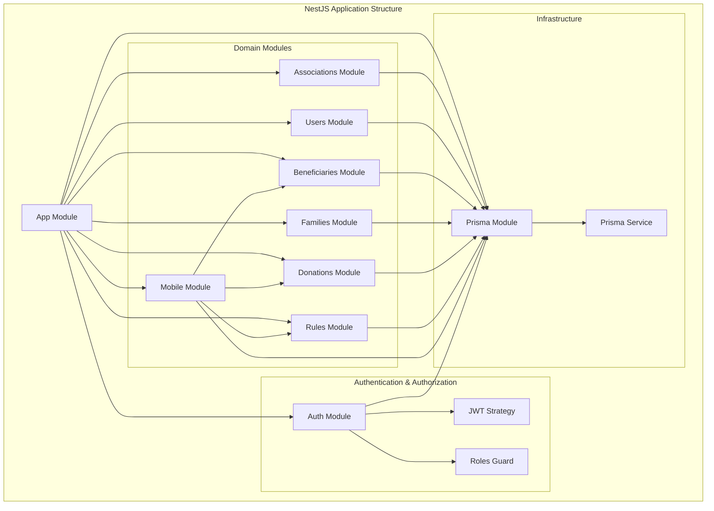
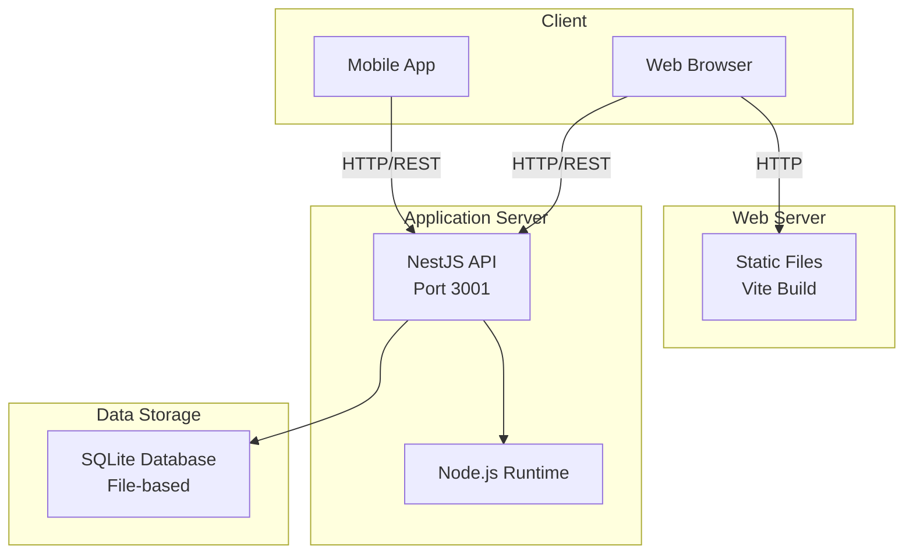
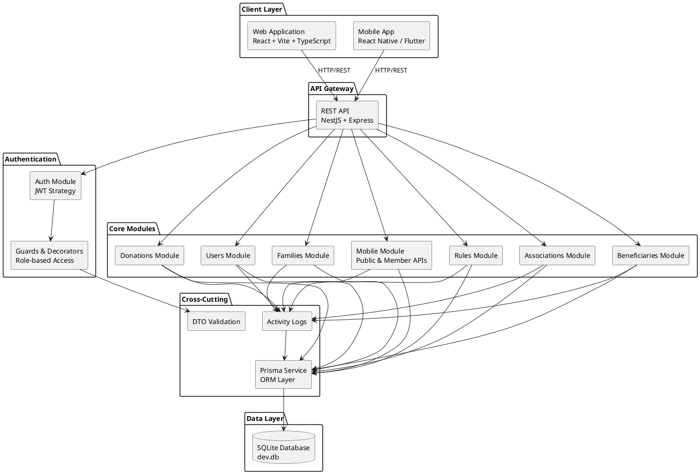
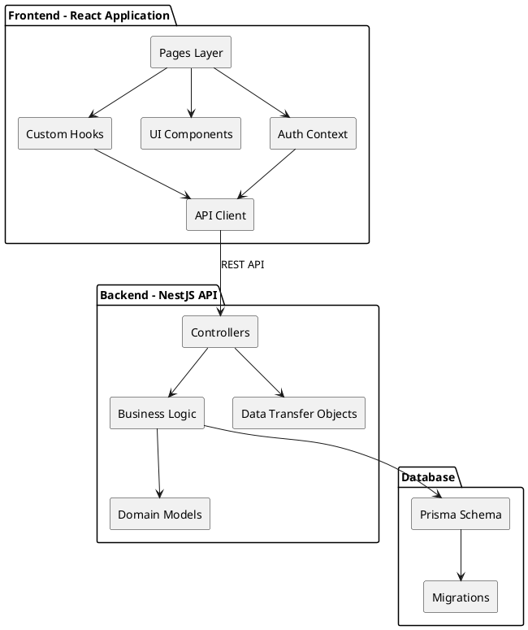
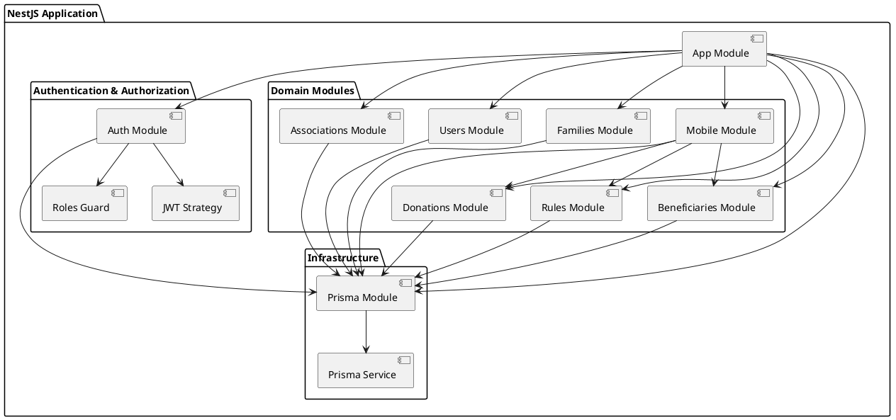
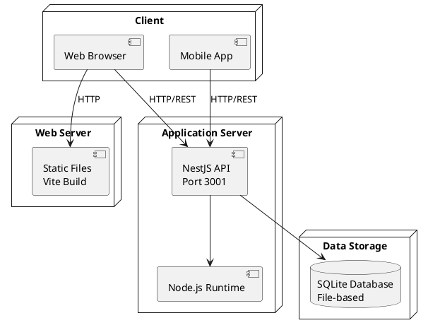

# Charity Impact Suite - Architecture Diagram

## System Architecture Overview

## Component Diagram

## Module Dependencies

## Deployment Architecture

## PlantUML Scripts

### 1. System Architecture - PlantUML

### 2. Component Diagram - PlantUML

### 3. Module Dependencies - PlantUML

### 4. Deployment Architecture - PlantUML

## Technology Stack

### Frontend
- **Framework**: React 18+ with TypeScript
- **Build Tool**: Vite
- **UI Library**: Tailwind CSS + shadcn/ui components
- **State Management**: React Context API
- **HTTP Client**: Axios (via custom API client)
- **Routing**: React Router

### Backend
- **Framework**: NestJS (Express-based)
- **Language**: TypeScript
- **ORM**: Prisma
- **Authentication**: JWT (JSON Web Tokens)
- **Validation**: class-validator & class-transformer
- **API Documentation**: Swagger/OpenAPI

### Database
- **Type**: SQLite (development)
- **Migration Tool**: Prisma Migrate
- **Seeding**: Custom seed scripts

### Development
- **Package Manager**: Bun (lockfile: bun.lockb)
- **Linting**: ESLint
- **Container**: Docker (docker-compose.yml)

## Security Architecture

### Authentication Flow
1. User submits credentials
2. Server validates and generates JWT
3. JWT stored in client (localStorage/secure storage)
4. JWT included in Authorization header for protected routes
5. Server validates JWT on each request

### Authorization Levels
- **Public**: Browse associations, anonymous donations
- **Donor**: Make authenticated donations, view history
- **Association Member**: Manage beneficiaries, families, dispatch donations
- **Association Admin**: All member permissions + manage users, rules
- **Super Admin**: Cross-association management, create associations

### API Security
- JWT-based authentication
- Role-based authorization guards
- Input validation with DTOs
- CORS configuration
- SQL injection prevention (Prisma ORM)
