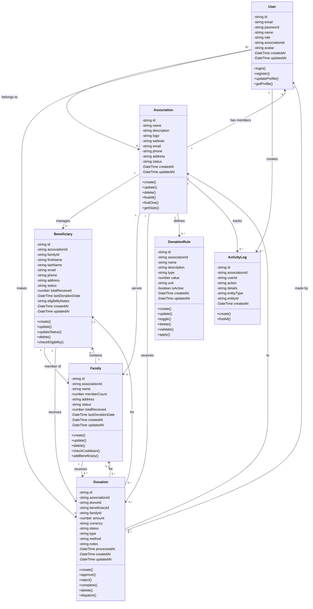
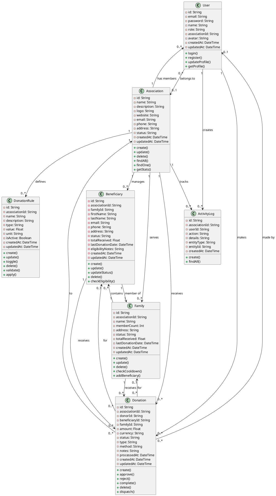

# Charity Impact Suite - Class Diagram (Simplified)

## Core Classes

**User**: System users with roles (SUPER_ADMIN, ASSOCIATION_ADMIN, ASSOCIATION_MEMBER, DONOR) belonging to associations

**Association**: Charity organizations managing beneficiaries, families, donations, and rules

**Beneficiary**: Individual recipients linked to families with eligibility tracking and status management

**Family**: Groups of beneficiaries with cooldown periods, donation limits, and status tracking

**Donation**: Monetary contributions with approval workflow (PENDING, APPROVED, REJECTED, COMPLETED) and multiple payment methods

**DonationRule**: Business rules for eligibility, frequency, and amount limits (FREQUENCY, AMOUNT, ELIGIBILITY)

**ActivityLog**: Audit trail tracking all actions performed by users on entities within associations

## PlantUML Script

