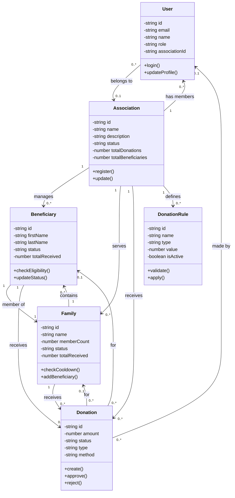

# Charity Impact Suite - Class Diagram (Simplified)

## Core Classes

**User**: System users with roles (admin, member, donor) belonging to associations

**Association**: Charity organizations managing beneficiaries and donations

**Beneficiary**: Individual recipients linked to families with eligibility tracking

**Family**: Groups of beneficiaries with cooldown periods and donation limits

**Donation**: Monetary contributions with approval workflow and status tracking

**DonationRule**: Business rules for eligibility, frequency, and amount limits
