# Charity Impact Suite - Class Diagram

```mermaid
classDiagram
    %% Enumerations
    class UserRole {
        <<enumeration>>
        SUPER_ADMIN
        ASSOCIATION_ADMIN
        ASSOCIATION_MEMBER
        DONOR
        PUBLIC
    }
    
    class AssociationStatus {
        <<enumeration>>
        ACTIVE
        PENDING
        SUSPENDED
    }
    
    class BeneficiaryStatus {
        <<enumeration>>
        ELIGIBLE
        INELIGIBLE
        PENDING_REVIEW
    }
    
    class FamilyStatus {
        <<enumeration>>
        ELIGIBLE
        INELIGIBLE
        COOLDOWN
    }
    
    class DonationStatus {
        <<enumeration>>
        PENDING
        APPROVED
        REJECTED
        COMPLETED
    }
    
    class DonationType {
        <<enumeration>>
        ONE_TIME
        RECURRING
    }
    
    class PaymentMethod {
        <<enumeration>>
        CARD
        BANK_TRANSFER
        CASH
        CHECK
    }
    
    class RuleType {
        <<enumeration>>
        FREQUENCY
        AMOUNT
        ELIGIBILITY
    }
    
    class TimeUnit {
        <<enumeration>>
        DAYS
        WEEKS
        MONTHS
        CURRENCY
    }
    
    class EntityType {
        <<enumeration>>
        DONATION
        BENEFICIARY
        FAMILY
        RULE
        MEMBER
    }
    
    %% Main Classes
    class User {
        -string id
        -string email
        -string name
        -UserRole role
        -string associationId
        -string avatar
        -string createdAt
        +login()
        +logout()
        +updateProfile()
        +hasPermission(action: string): boolean
    }
    
    class Association {
        -string id
        -string name
        -string description
        -string logo
        -string website
        -string email
        -string phone
        -string address
        -AssociationStatus status
        -number totalDonations
        -number totalBeneficiaries
        -number totalMembers
        -string createdAt
        -ImpactMetrics impactMetrics
        +register()
        +update()
        +suspend()
        +activate()
        +addMember(user: User)
        +removeMember(userId: string)
        +calculateImpact(): ImpactMetrics
    }
    
    class ImpactMetrics {
        -number familiesHelped
        -number donationsThisMonth
        -number averageDonation
        -number successRate
        +calculate()
        +update()
    }
    
    class Beneficiary {
        -string id
        -string associationId
        -string familyId
        -string firstName
        -string lastName
        -string email
        -string phone
        -string address
        -BeneficiaryStatus status
        -string lastDonationDate
        -number totalReceived
        -string createdAt
        -string eligibilityNotes
        +register()
        +updateStatus(status: BeneficiaryStatus)
        +checkEligibility(): boolean
        +addDonation(donation: Donation)
        +getHistory(): Donation[]
    }
    
    class Family {
        -string id
        -string associationId
        -string name
        -number memberCount
        -string address
        -number totalReceived
        -string lastDonationDate
        -FamilyStatus status
        +create()
        +update()
        +addBeneficiary(beneficiary: Beneficiary)
        +removeBeneficiary(beneficiaryId: string)
        +checkCooldown(): boolean
        +calculateTotalReceived(): number
    }
    
    class Donation {
        -string id
        -string associationId
        -string donorId
        -string beneficiaryId
        -string familyId
        -number amount
        -string currency
        -DonationStatus status
        -DonationType type
        -PaymentMethod method
        -string createdAt
        -string processedAt
        -string notes
        +create()
        +approve()
        +reject()
        +complete()
        +validateRules(): boolean
        +process()
    }
    
    class DonationRule {
        -string id
        -string associationId
        -string name
        -string description
        -RuleType type
        -number value
        -TimeUnit unit
        -boolean isActive
        -string createdAt
        +create()
        +update()
        +enable()
        +disable()
        +validate(donation: Donation): boolean
        +apply(context: object): boolean
    }
    
    class ActivityLog {
        -string id
        -string associationId
        -string userId
        -string action
        -string details
        -string timestamp
        -EntityType entityType
        -string entityId
        +log()
        +query(filters: object): ActivityLog[]
        +export(): string
    }
    
    %% Service Classes
    class AuthenticationService {
        <<service>>
        +login(email: string, password: string): User
        +signup(userData: object): User
        +logout()
        +resetPassword(email: string)
        +verifyToken(token: string): boolean
    }
    
    class AssociationService {
        <<service>>
        +getAll(): Association[]
        +getById(id: string): Association
        +create(data: object): Association
        +update(id: string, data: object): Association
        +suspend(id: string)
        +activate(id: string)
    }
    
    class BeneficiaryService {
        <<service>>
        +getAll(associationId: string): Beneficiary[]
        +getById(id: string): Beneficiary
        +create(data: object): Beneficiary
        +update(id: string, data: object): Beneficiary
        +reviewEligibility(id: string): boolean
        +updateStatus(id: string, status: BeneficiaryStatus)
    }
    
    class DonationService {
        <<service>>
        +getAll(filters: object): Donation[]
        +getById(id: string): Donation
        +create(data: object): Donation
        +approve(id: string)
        +reject(id: string)
        +process(id: string)
        +validateRules(donation: Donation): boolean
    }
    
    class RuleEngine {
        <<service>>
        +evaluateRules(donation: Donation, rules: DonationRule[]): boolean
        +checkFrequency(family: Family, rule: DonationRule): boolean
        +checkAmount(donation: Donation, rule: DonationRule): boolean
        +checkEligibility(beneficiary: Beneficiary, rule: DonationRule): boolean
    }
    
    class ReportingService {
        <<service>>
        +generateDashboard(associationId: string): object
        +generateReport(type: string, filters: object): object
        +getImpactMetrics(associationId: string): ImpactMetrics
        +exportData(format: string): string
    }
    
    class AuditService {
        <<service>>
        +logActivity(activity: ActivityLog)
        +getAuditLog(filters: object): ActivityLog[]
        +trackChanges(entityType: EntityType, entityId: string, changes: object)
    }
    
    %% Relationships
    User "1" --> "1" UserRole : has
    User "0..*" --> "0..1" Association : belongs to
    
    Association "1" --> "1" AssociationStatus : has
    Association "1" --> "1" ImpactMetrics : contains
    Association "1" --> "0..*" User : has members
    Association "1" --> "0..*" Beneficiary : manages
    Association "1" --> "0..*" Family : serves
    Association "1" --> "0..*" Donation : receives
    Association "1" --> "0..*" DonationRule : defines
    Association "1" --> "0..*" ActivityLog : tracks
    
    Family "1" --> "1" FamilyStatus : has
    Family "1" --> "0..*" Beneficiary : contains
    Family "1" --> "1" Association : registered with
    Family "1" --> "0..*" Donation : receives
    
    Beneficiary "1" --> "1" BeneficiaryStatus : has
    Beneficiary "1" --> "1" Association : registered with
    Beneficiary "1" --> "1" Family : member of
    Beneficiary "1" --> "0..*" Donation : receives
    
    Donation "1" --> "1" DonationStatus : has
    Donation "1" --> "1" DonationType : has
    Donation "1" --> "1" PaymentMethod : uses
    Donation "1" --> "1" Association : made to
    Donation "0..*" --> "0..1" User : made by
    Donation "0..*" --> "0..1" Beneficiary : for
    Donation "0..*" --> "0..1" Family : for
    
    DonationRule "1" --> "1" RuleType : has
    DonationRule "1" --> "0..1" TimeUnit : uses
    DonationRule "1" --> "1" Association : belongs to
    
    ActivityLog "1" --> "1" EntityType : tracks
    ActivityLog "1" --> "1" Association : belongs to
    ActivityLog "1" --> "1" User : performed by
    
    %% Service Dependencies
    AuthenticationService ..> User : manages
    
    AssociationService ..> Association : manages
    AssociationService ..> ImpactMetrics : calculates
    
    BeneficiaryService ..> Beneficiary : manages
    BeneficiaryService ..> DonationRule : validates with
    
    DonationService ..> Donation : manages
    DonationService ..> RuleEngine : uses
    DonationService ..> AuditService : logs to
    
    RuleEngine ..> DonationRule : evaluates
    RuleEngine ..> Family : checks
    RuleEngine ..> Beneficiary : validates
    RuleEngine ..> Donation : validates
    
    ReportingService ..> Association : reports on
    ReportingService ..> Donation : analyzes
    ReportingService ..> ImpactMetrics : generates
    
    AuditService ..> ActivityLog : creates
```

## Class Descriptions

### Core Domain Classes

#### User
Represents system users with different roles (super admin, association admin, member, donor, public).

#### Association
Charity organizations that manage beneficiaries and process donations. Contains impact metrics and manages members.

#### ImpactMetrics
Value object containing key performance indicators for an association (families helped, donations, success rate).

#### Beneficiary
Individual recipients of donations, linked to families and associations. Tracks eligibility status and donation history.

#### Family
Groups beneficiaries into family units. Manages cooldown periods and aggregate donation limits.

#### Donation
Represents a monetary contribution from a donor to a beneficiary/family through an association. Tracks status through approval workflow.

#### DonationRule
Configurable business rules for donation eligibility, frequency limits, and amount restrictions.

#### ActivityLog
Audit trail of all system activities for compliance and transparency.

### Service Layer

#### AuthenticationService
Handles user authentication, registration, and session management.

#### AssociationService
CRUD operations and business logic for charity associations.

#### BeneficiaryService
Manages beneficiary lifecycle including eligibility reviews and status updates.

#### DonationService
Orchestrates donation workflow including validation, approval, and processing.

#### RuleEngine
Evaluates business rules against donations to ensure policy compliance.

#### ReportingService
Generates analytics, dashboards, and reports for stakeholders.

#### AuditService
Maintains comprehensive audit logs of all system activities.

## Design Patterns Applied

- **Service Layer Pattern**: Separates business logic from domain models
- **Repository Pattern**: Implicit in service classes for data access
- **Strategy Pattern**: RuleEngine evaluates different rule types
- **Observer Pattern**: ActivityLog tracks entity changes
- **Value Object Pattern**: ImpactMetrics is immutable calculated data
