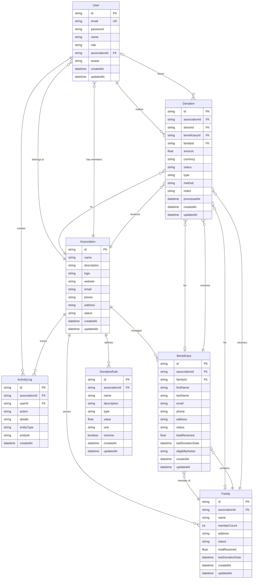
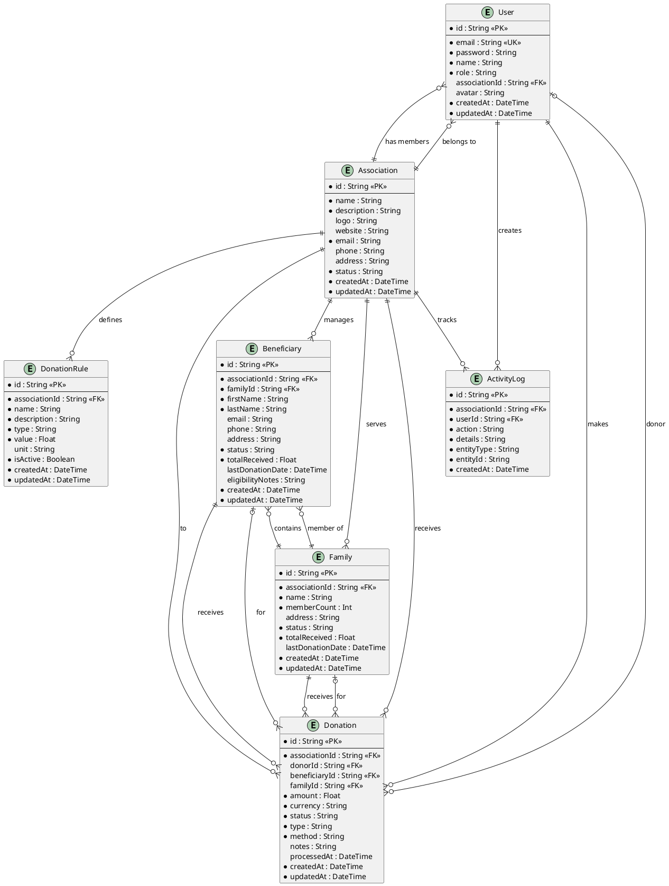

# Charity Impact Suite - Entity Relationship Diagram

## Entity Descriptions

### User
Represents all system users with different roles (SUPER_ADMIN, ASSOCIATION_ADMIN, ASSOCIATION_MEMBER, DONOR).
- **Roles**: Controls access to different features
- **Association Link**: Members belong to one association (optional for donors)

### Association
Charity organizations that manage beneficiaries and receive donations.
- **Status**: ACTIVE, PENDING, SUSPENDED
- **Aggregates**: Tracks total donations, beneficiaries, and members

### Beneficiary
Individual recipients who receive donations through their family.
- **Status**: ELIGIBLE, INELIGIBLE, PENDING_REVIEW
- **Tracking**: Records total received amount and last donation date

### Family
Groups of beneficiaries with collective donation tracking.
- **Status**: ELIGIBLE, INELIGIBLE, COOLDOWN
- **Cooldown**: Enforces waiting periods between donations

### Donation
Monetary contributions from donors to associations for beneficiaries/families.
- **Status**: PENDING, APPROVED, REJECTED, COMPLETED
- **Type**: ONE_TIME, RECURRING
- **Method**: CARD, BANK_TRANSFER, CASH, CHECK

### DonationRule
Business rules that govern donation eligibility and limits.
- **Type**: FREQUENCY, AMOUNT, ELIGIBILITY
- **Value & Unit**: Configurable thresholds (days, weeks, months, currency)

### ActivityLog
Audit trail of all actions performed in the system.
- **EntityType**: DONATION, BENEFICIARY, FAMILY, RULE, MEMBER
- **Tracking**: Who did what, when, and on which entity

## PlantUML Script

## Database Schema Notes

### SQLite Implementation
The current implementation uses SQLite with Prisma ORM:
- **Enums as Strings**: SQLite doesn't support native enums, so enum values are stored as strings
- **Cascade Deletes**: Beneficiaries, families, donations, rules, and logs cascade when associations are deleted
- **Default Values**: Status fields have default values (e.g., PENDING, ELIGIBLE)
- **Timestamps**: Automatic tracking with `createdAt` and `updatedAt`

### Key Constraints
- **User.email**: Unique constraint for authentication
- **Foreign Keys**: All relationships enforced with foreign key constraints
- **Cascade Rules**: Child entities deleted when parent is removed
- **Optional Fields**: Nullable fields marked with `?` in schema
