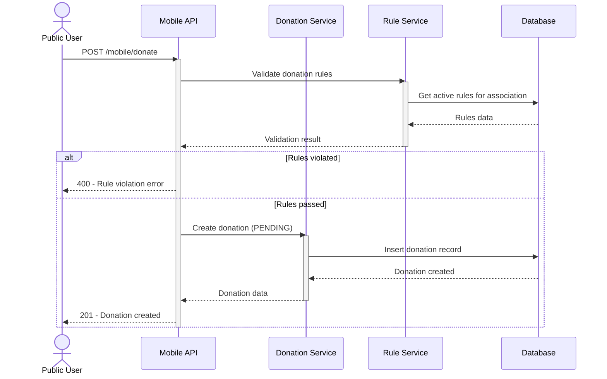
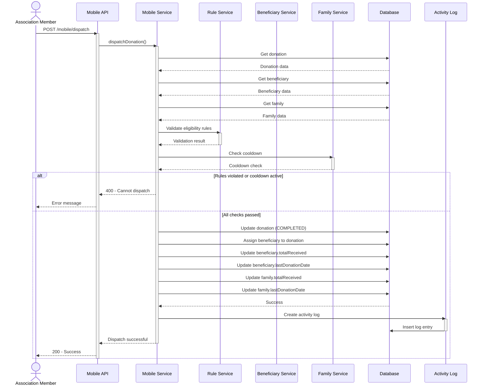
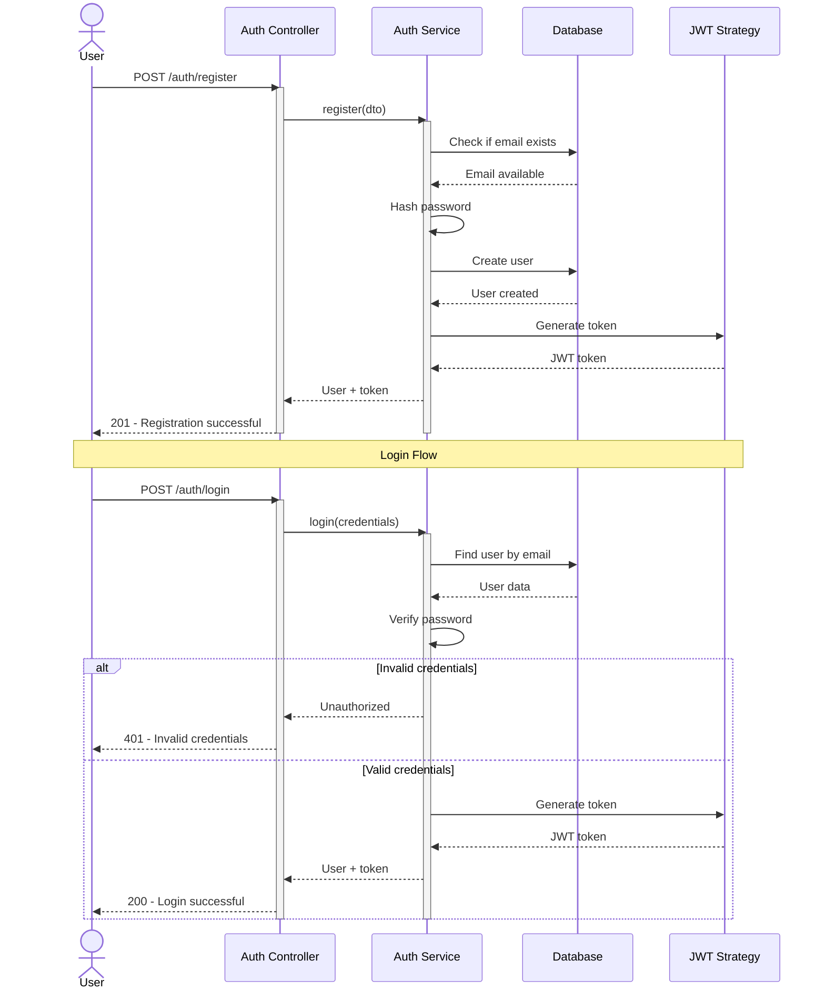
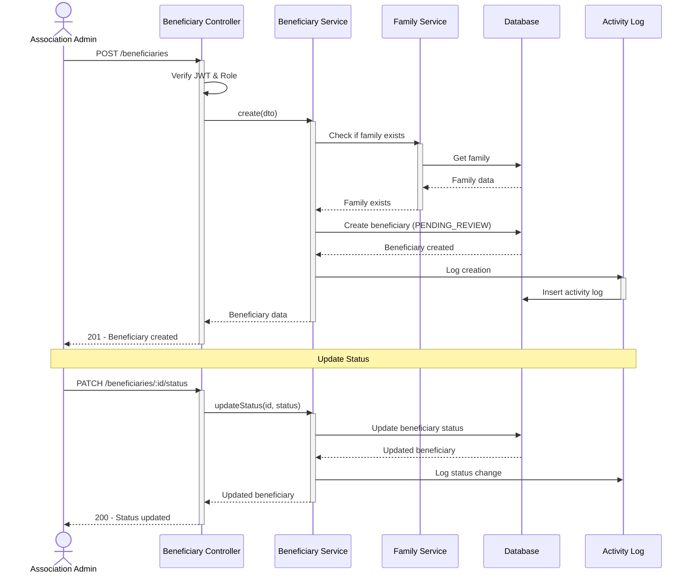
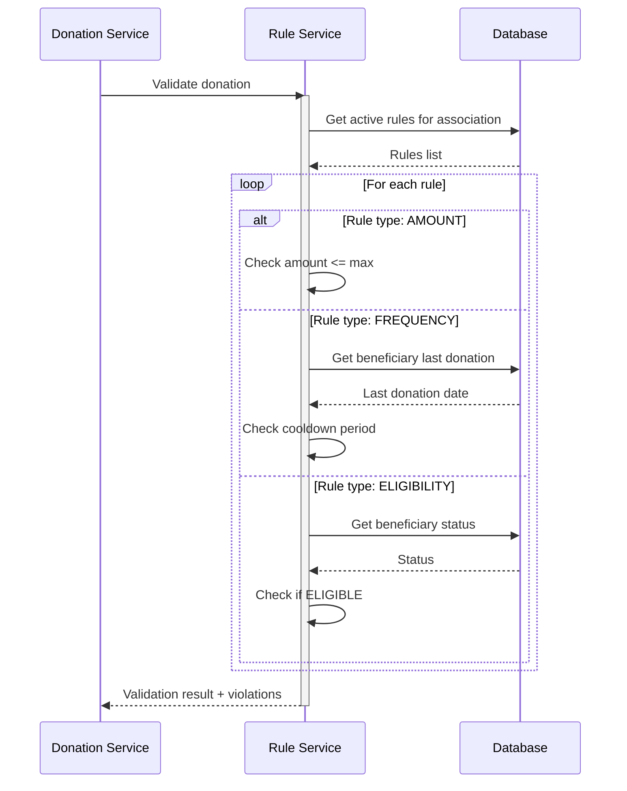
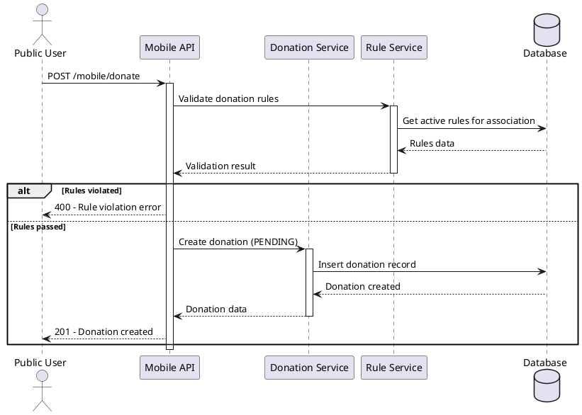
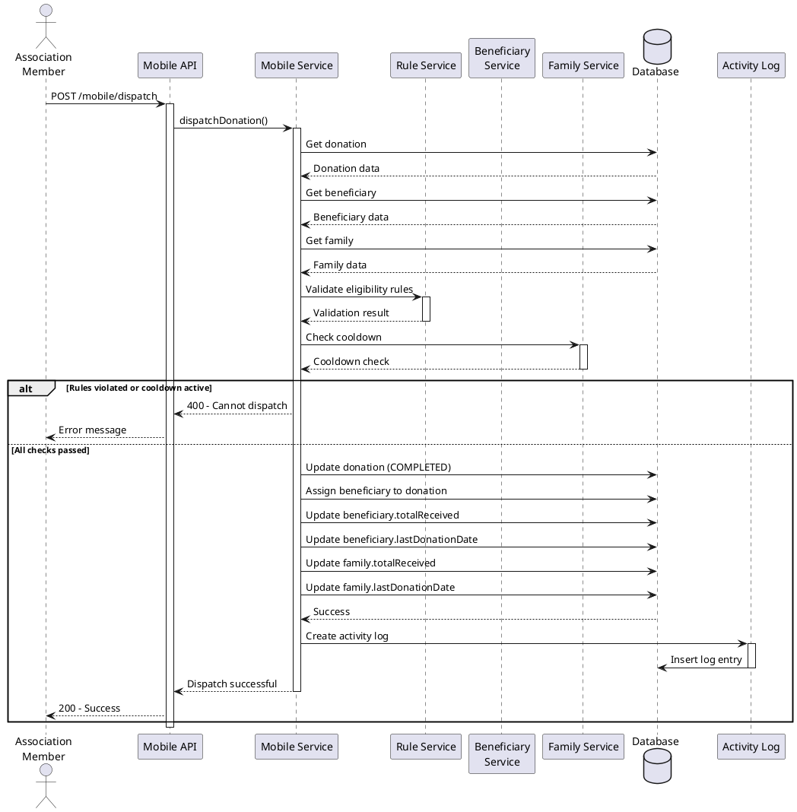
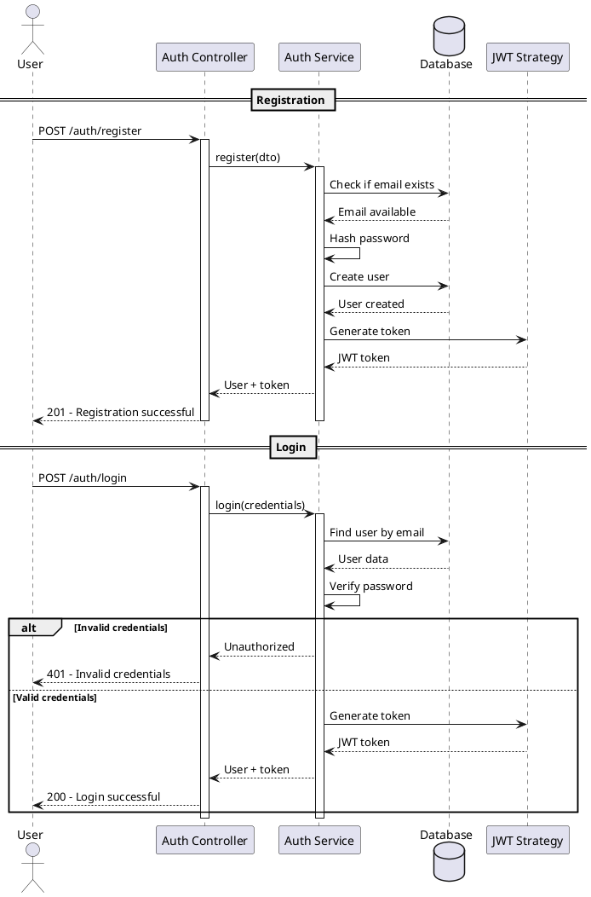
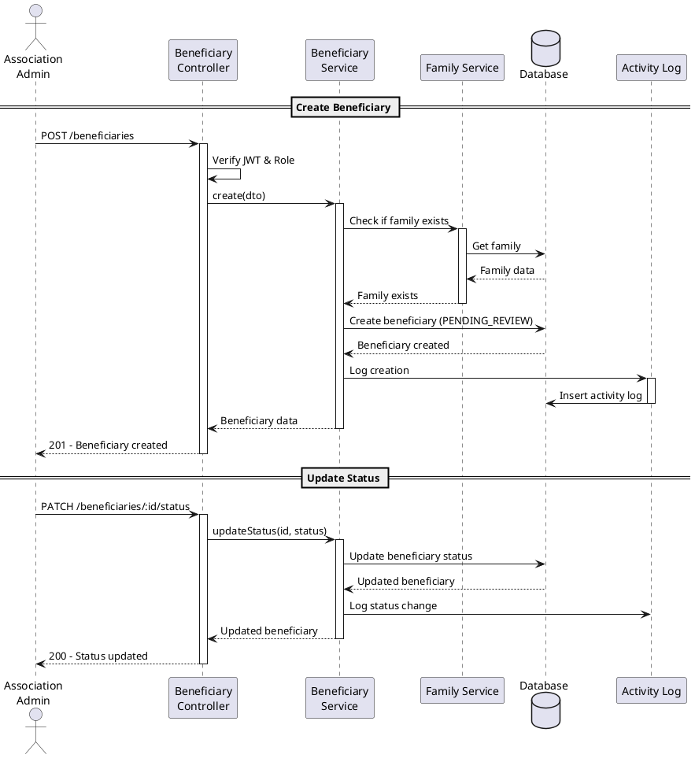
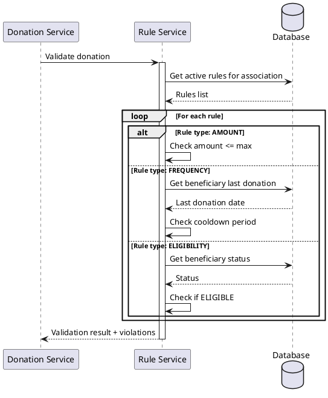

# Charity Impact Suite - Sequence Diagrams

## 1. Donation Flow (Anonymous)

## 2. Donation Dispatch Flow

## 3. User Authentication Flow

## 4. Beneficiary Management Flow

## 5. Rule Validation Flow

## PlantUML Scripts

### 1. Donation Flow (Anonymous) - PlantUML

### 2. Donation Dispatch Flow - PlantUML

### 3. User Authentication Flow - PlantUML

### 4. Beneficiary Management Flow - PlantUML

### 5. Rule Validation Flow - PlantUML

## Key Flows Summary

1. **Anonymous Donation**: Public users can donate without authentication, but donations require approval
2. **Donation Dispatch**: Members assign approved donations to eligible beneficiaries with rule enforcement
3. **Authentication**: Secure user registration and login with JWT tokens
4. **Beneficiary Management**: Admins create and manage beneficiaries with status tracking
5. **Rule Validation**: Automated checking of donation rules (amount, frequency, eligibility)
