# Charity Impact Suite - Use Case Diagram

```mermaid
graph TB
    subgraph System["Charity Impact Suite System"]
        subgraph AuthenticationModule["Authentication Module"]
            UC1[Login]
            UC2[Sign Up]
            UC3[Manage Profile]
        end
        
        subgraph AssociationManagement["Association Management"]
            UC4[Browse Associations]
            UC5[View Association Details]
            UC6[Create Association]
            UC7[Update Association]
            UC8[Suspend Association]
        end
        
        subgraph BeneficiaryManagement["Beneficiary Management"]
            UC9[Add Beneficiary]
            UC10[Review Beneficiary Eligibility]
            UC11[Update Beneficiary Status]
            UC12[View Beneficiary History]
        end
        
        subgraph FamilyManagement["Family Management"]
            UC13[Register Family]
            UC14[Update Family Info]
            UC15[Track Family Donations]
            UC16[Check Cooldown Period]
        end
        
        subgraph DonationManagement["Donation Management"]
            UC17[Make Donation]
            UC18[Record Donation]
            UC19[Approve Donation]
            UC20[Reject Donation]
            UC21[Track Donation Status]
        end
        
        subgraph RulesManagement["Rules Management"]
            UC22[Configure Eligibility Rules]
            UC23[Set Frequency Rules]
            UC24[Set Amount Limits]
            UC25[Enable/Disable Rules]
        end
        
        subgraph ReportingAnalytics["Reporting & Analytics"]
            UC26[View Dashboard]
            UC27[Generate Reports]
            UC28[View Impact Metrics]
            UC29[View Audit Log]
        end
        
        subgraph UserManagement["User Management"]
            UC30[Add User]
            UC31[Assign Roles]
            UC32[Manage Permissions]
            UC33[Remove User]
        end
    end
    
    %% Actors
    Public((Public User))
    Donor((Donor))
    Member((Association Member))
    Admin((Association Admin))
    SuperAdmin((Super Admin))
    
    %% Public User Use Cases
    Public --> UC1
    Public --> UC2
    Public --> UC4
    Public --> UC5
    
    %% Donor Use Cases
    Donor --> UC1
    Donor --> UC3
    Donor --> UC4
    Donor --> UC5
    Donor --> UC17
    Donor --> UC21
    
    %% Association Member Use Cases
    Member --> UC1
    Member --> UC3
    Member --> UC9
    Member --> UC10
    Member --> UC12
    Member --> UC13
    Member --> UC14
    Member --> UC15
    Member --> UC18
    Member --> UC26
    
    %% Association Admin Use Cases
    Admin --> UC1
    Admin --> UC3
    Admin --> UC7
    Admin --> UC9
    Admin --> UC10
    Admin --> UC11
    Admin --> UC12
    Admin --> UC13
    Admin --> UC14
    Admin --> UC15
    Admin --> UC16
    Admin --> UC18
    Admin --> UC19
    Admin --> UC20
    Admin --> UC21
    Admin --> UC22
    Admin --> UC23
    Admin --> UC24
    Admin --> UC25
    Admin --> UC26
    Admin --> UC27
    Admin --> UC28
    Admin --> UC29
    Admin --> UC30
    Admin --> UC31
    
    %% Super Admin Use Cases
    SuperAdmin --> UC1
    SuperAdmin --> UC3
    SuperAdmin --> UC4
    SuperAdmin --> UC5
    SuperAdmin --> UC6
    SuperAdmin --> UC7
    SuperAdmin --> UC8
    SuperAdmin --> UC26
    SuperAdmin --> UC27
    SuperAdmin --> UC28
    SuperAdmin --> UC29
    SuperAdmin --> UC30
    SuperAdmin --> UC31
    SuperAdmin --> UC32
    SuperAdmin --> UC33
    
    %% Include relationships
    UC17 -.->|includes| UC16
    UC18 -.->|includes| UC10
    UC19 -.->|includes| UC16
    UC10 -.->|includes| UC22
    
    %% Extend relationships
    UC11 -.->|extends| UC10
    UC20 -.->|extends| UC19
    
    classDef actor fill:#e1f5ff,stroke:#01579b,stroke-width:2px
    classDef usecase fill:#fff9c4,stroke:#f57f17,stroke-width:1px
    
    class Public,Donor,Member,Admin,SuperAdmin actor
```



## Use Case Descriptions

### Authentication Module
- **UC1 (Login)**: Users authenticate to access the system
- **UC2 (Sign Up)**: New users register with role selection
- **UC3 (Manage Profile)**: Users update their profile information

### Association Management
- **UC4 (Browse Associations)**: View list of active charity associations
- **UC5 (View Association Details)**: View detailed information about an association
- **UC6 (Create Association)**: Register a new charity association
- **UC7 (Update Association)**: Modify association information
- **UC8 (Suspend Association)**: Temporarily disable an association

### Beneficiary Management
- **UC9 (Add Beneficiary)**: Register a new beneficiary in the system
- **UC10 (Review Beneficiary Eligibility)**: Assess if beneficiary meets criteria
- **UC11 (Update Beneficiary Status)**: Change beneficiary eligibility status
- **UC12 (View Beneficiary History)**: Track beneficiary donation history

### Family Management
- **UC13 (Register Family)**: Create family unit with members
- **UC14 (Update Family Info)**: Modify family details
- **UC15 (Track Family Donations)**: Monitor total family donations
- **UC16 (Check Cooldown Period)**: Verify family donation eligibility

### Donation Management
- **UC17 (Make Donation)**: Donor contributes to association/beneficiary
- **UC18 (Record Donation)**: Log donation transaction
- **UC19 (Approve Donation)**: Authorize pending donation
- **UC20 (Reject Donation)**: Deny donation transaction
- **UC21 (Track Donation Status)**: Monitor donation processing

### Rules Management
- **UC22 (Configure Eligibility Rules)**: Set beneficiary criteria
- **UC23 (Set Frequency Rules)**: Define donation frequency limits
- **UC24 (Set Amount Limits)**: Configure donation amount restrictions
- **UC25 (Enable/Disable Rules)**: Activate or deactivate rules

### Reporting & Analytics
- **UC26 (View Dashboard)**: Access main analytics dashboard
- **UC27 (Generate Reports)**: Create custom reports
- **UC28 (View Impact Metrics)**: Track association impact statistics
- **UC29 (View Audit Log)**: Review system activity logs

### User Management
- **UC30 (Add User)**: Create new user account
- **UC31 (Assign Roles)**: Set user permissions
- **UC32 (Manage Permissions)**: Configure role-based access
- **UC33 (Remove User)**: Deactivate user account
```
