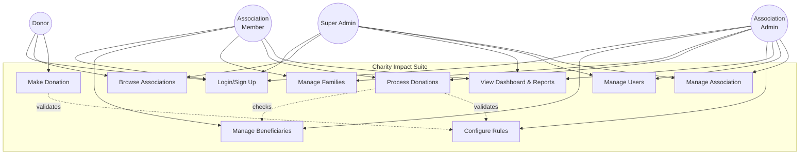

# Charity Impact Suite - Use Case Diagram (Simplified)



## Core Use Cases

**UC1 - Login/Sign Up**: User authentication and registration with role selection

**UC2 - Browse Associations**: View and search charity associations

**UC3 - Make Donation**: Donors contribute to associations or beneficiaries

**UC4 - Manage Beneficiaries**: Add, review eligibility, and update beneficiary status

**UC5 - Manage Families**: Register and track family units with donation history

**UC6 - Process Donations**: Record, approve/reject, and track donation status

**UC7 - Configure Rules**: Set eligibility, frequency, and amount limit rules

**UC8 - View Dashboard & Reports**: Access analytics, impact metrics, and audit logs

**UC9 - Manage Users**: Add users, assign roles, and manage permissions

**UC10 - Manage Association**: Create, update, and manage association details
```
