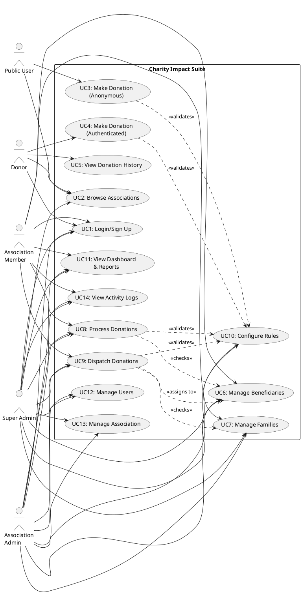

# Charity Impact Suite - Use Case Diagram (Simplified)

```mermaid
graph TB
    subgraph System["Charity Impact Suite"]
        UC1[Login/Sign Up]
        UC2[Browse Associations]
        UC3[Make Donation - Anonymous]
        UC4[Make Donation - Authenticated]
        UC5[View Donation History]
        UC6[Manage Beneficiaries]
        UC7[Manage Families]
        UC8[Process Donations]
        UC9[Dispatch Donations]
        UC10[Configure Rules]
        UC11[View Dashboard & Reports]
        UC12[Manage Users]
        UC13[Manage Association]
        UC14[View Activity Logs]
    end
    
    %% Actors
    Public((Public User))
    Donor((Donor))
    Member((Association<br/>Member))
    Admin((Association<br/>Admin))
    SuperAdmin((Super Admin))
    
    %% Public User Cases
    Public --> UC2
    Public --> UC3
    
    %% Donor Use Cases
    Donor --> UC1
    Donor --> UC2
    Donor --> UC4
    Donor --> UC5
    
    %% Association Member Use Cases
    Member --> UC1
    Member --> UC6
    Member --> UC7
    Member --> UC8
    Member --> UC9
    Member --> UC11
    Member --> UC14
    
    %% Association Admin Use Cases
    Admin --> UC1
    Admin --> UC6
    Admin --> UC7
    Admin --> UC8
    Admin --> UC9
    Admin --> UC10
    Admin --> UC11
    Admin --> UC12
    Admin --> UC13
    Admin --> UC14
    
    %% Super Admin Use Cases
    SuperAdmin --> UC1
    SuperAdmin --> UC2
    SuperAdmin --> UC6
    SuperAdmin --> UC7
    SuperAdmin --> UC8
    SuperAdmin --> UC9
    SuperAdmin --> UC10
    SuperAdmin --> UC11
    SuperAdmin --> UC12
    SuperAdmin --> UC13
    SuperAdmin --> UC14
    
    %% Key relationships
    UC3 -.->|validates| UC10
    UC4 -.->|validates| UC10
    UC8 -.->|checks| UC6
    UC8 -.->|validates| UC10
    UC9 -.->|assigns to| UC6
    UC9 -.->|checks| UC7
    UC9 -.->|validates| UC10
```



## Core Use Cases

**UC1 - Login/Sign Up**: User authentication and registration with role selection (SUPER_ADMIN, ASSOCIATION_ADMIN, ASSOCIATION_MEMBER, DONOR)

**UC2 - Browse Associations**: View and search active charity associations with public statistics

**UC3 - Make Donation (Anonymous)**: Public users can contribute to associations without authentication

**UC4 - Make Donation (Authenticated)**: Registered donors contribute with tracking and history

**UC5 - View Donation History**: Donors view their donation history and receipts

**UC6 - Manage Beneficiaries**: Add, review eligibility, update status (ELIGIBLE, INELIGIBLE, PENDING_REVIEW)

**UC7 - Manage Families**: Register and track family units with cooldown periods and donation history

**UC8 - Process Donations**: Record, approve/reject, and track donation status (PENDING, APPROVED, REJECTED, COMPLETED)

**UC9 - Dispatch Donations**: Assign approved donations to eligible beneficiaries, enforcing rules and cooldowns

**UC10 - Configure Rules**: Set eligibility, frequency (days/weeks/months), and amount limit rules

**UC11 - View Dashboard & Reports**: Access analytics, impact metrics, and statistics for associations

**UC12 - Manage Users**: Add users, assign roles, and manage permissions within associations

**UC13 - Manage Association**: Create, update, and manage association details and settings

**UC14 - View Activity Logs**: Audit trail of all actions performed within the system

## PlantUML Script



```
